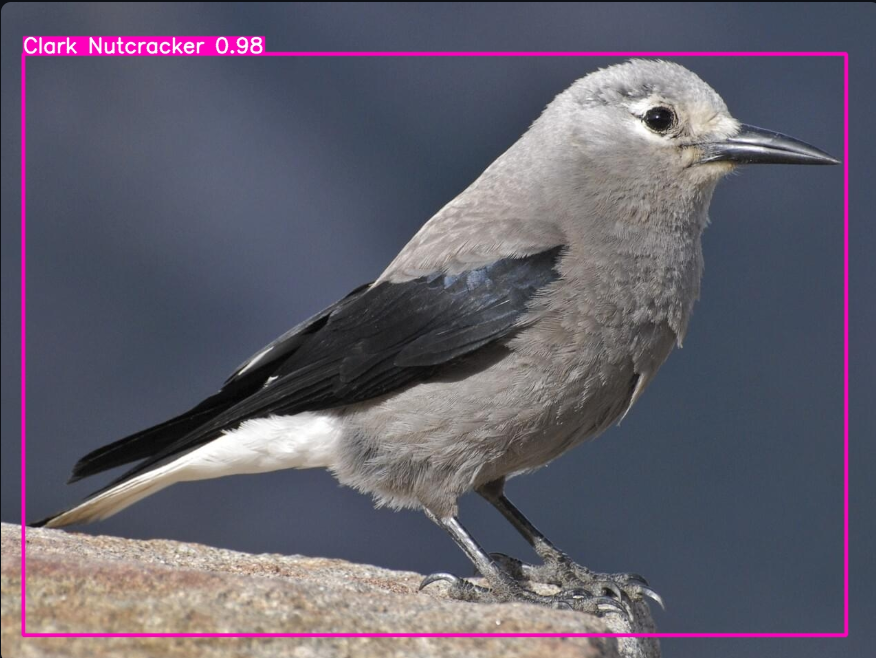

# Birdscribe AI

Birdscribe AI is a Streamlit-based application that allows users to detect birds in images and videos using a YOLO model. It then retrieves additional information about the detected bird species using a large language model (LLM) hosted on Hugging Face.

## Overview
Key Features
✅ AI-Powered Bird Detection – Uses YOLO-based Computer Vision to identify 200+ bird species from images and videos.
✅ Conversational Bird Insights – Integrates Mistral-7B LLM to provide species details, habitat information, and conservation status.
✅ Real-Time Identification – Quickly detects birds and displays relevant information to aid researchers, birdwatchers, and conservationists.
✅ User-Friendly Interface – Developed with Streamlit, ensuring a smooth and accessible experience for all users.
✅ Community-Driven Conservation – Encourages citizen scientists to contribute data, fostering global engagement in bird conservation.

## Inspiration
1. Birds as Environmental Indicators – Their decline signals ecosystem imbalances, highlighting the need for monitoring​.

2. Biodiversity Crisis – Nearly half of bird species are declining, with one in eight at risk of extinction​.

3. Human Impact – Deforestation, agriculture, and urbanization threaten bird populations, requiring better tracking tools​.

4. Climate Change – Rising temperatures and habitat loss accelerate extinction risks, necessitating real-time AI monitoring​.

5. Conservation Success – AI tools like BirdScribe can support species protection and amplify conservation efforts​.

6. Public Engagement – Encouraging citizen science and public participation is key to conservation​.

7. AI for Wildlife Protection – Computer Vision and LLMs enhance bird identification and data analysis, making conservation more effective​.

References -  
1. https://sites.google.com/xtec.cat/sdg-15-life-on-land-birds/home
2. https://www.birds.cornell.edu/home/bring-birds-back/

## Features

- **Bird Detection**: Uses YOLO object detection to identify birds in images and videos.
- **Bird Information Retrieval**: Fetches details like scientific name, geographical distribution, size, weight, and lifespan from an LLM.
- **User Interaction**: Users can upload images or videos, ask additional questions, and receive AI-generated responses.

## Technologies Used

- **Streamlit**: For building the web application.
- **YOLO (You Only Look Once)**: For bird detection in images and videos.
- **Hugging Face Inference API**: For retrieving bird-related information using the Mistral-7B-Instruct-v0.2 model.
- **OpenCV**: For image and video processing.
- **PIL (Pillow)**: For handling image files.
- **NumPy**: For efficient array operations.

## Installation

To run this project locally, follow these steps:

### Prerequisites

Ensure you have Python installed (preferably Python 3.8 or later).

### Setup

1. Clone the repository:
   ```sh
   git clone https://github.com/your-repo/birdscribe-ai.git
   cd birdscribe-ai
   ```
2. Install required dependencies:
   ```sh
   pip install -r requirements.txt
   ```
3. Run the Streamlit app:
   ```sh
   streamlit run app.py
   ```

## How to Use

1. Choose a file type (Image or Video).
2. Upload an image (JPG, JPEG, PNG) or a video (MP4, AVI, MPEG4).
3. The app will detect birds and display their names.
4. Additional bird information will be retrieved and displayed.
5. Users can ask further questions via the sidebar chatbot.

# Detection Results 


<video width="600" controls>
  <source src="assets/Downy_Woodpecker.mp4" type="video/mp4">
</video>


## Dataset
The origincal dataset can be accessed using this link:
https://www.kaggle.com/datasets/veeralakrishna/200-bird-species-with-11788-images/data

## Author

[Priyesh Gawali](https://github.com/Roronoa-17)
[Abhijit Dhande](https://github.com/abhijit-8688)
[Aniket Ambatkar](https://github.com/AniketAmbatkar)
[Rupak Kadhare](https://github.com/RupakKadhare15)
